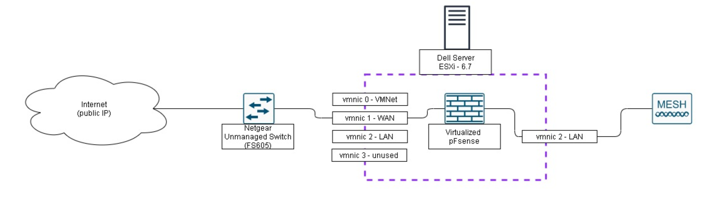

# Install Virtual Firewall

## Installing pfSense and replacing your AT&T commercial router

I take no credit for this bypass. I used the help of others to implement this bypass and I just want to document the information/share the knowledge \(reference of bypass linked below\). This guide is oriented to those who AT&T fiber and do not have any other services being provided by AT&T \(such as AT&T U-Verse TV\). I wanted to replace my AT&T BGW210 with pfSense to be able to play around with the traffic at home and use it for other labs. This guide will present two options:   
1. Place the AT&T BGW210 in "bridged mode"   
2. Replace the AT&T BGW210 with pfSense



One thing to keep in mind, this guide takes advantage of the BGW210 only having to authenticate with AT&T at the very beginning. If the power at home were to ever shut down, I would have to plug the BGW210 back in and authenticate with AT&T before plugging my WAN back into pfSense.

#### Resources/Equipment Used

pfSense 2.4.4   
Dell R710 Server   
ESXi 6.7.0   
Unmannaged Switch   
Cat5e cables \(3\)   
TP-Link Deco

I have seen several guides for pfSense use ubiquiti access point's instead but the TP Link Deco I found was cheaper and provided similar capabilities.

### Option 1: "Bridged" Mode

I would only use this method if you didn't want to go through the hassel of plugging the BGW210 each time a power failure occured. Personally, I noticed slower connection speeds throughout the house by using this method.

Network Diagram Overview:

#### 1.A Enable IP Passthrough on modem

Unfortunately the modem does not have a bridged mode feature, but you can enable IP Passthrough on the admin page.   
  
1. Open a browser on a computer that is directly connected to the BGW210.  
2. In the address bar, enter [http://192.168.1.254](http://192.168.1.254).   
3. Select the Firewall tab in the RG GUI page.   
4. Select IP Passthrough below the Firewall tab.   
5. Select Passthrough option from the Allocation Mode drop-down menu.   
6. Select manual from the Passthrough Mode drop-down.   
7. Manually configure your device to use the WAN IP address, default gateway, and Subnet mask provided to you in Broadband &gt; Status.

#### 1.B Install pfSense with ESXi

I installed pfSense on ESXi using the [virtualizing pfSense Guide](https://docs.netgate.com/pfsense/en/latest/virtualization/virtualizing-pfsense-with-vmware-vsphere-esxi.html). I'll provide instructions as to where I deviated from the guide linked above.

Once the VM has been created, the WAN and LAN NICs have been assigned to the VM, and you completed the install, head on over to 192.168.1.1 \(or the IP you assigned on the LAN\) and run through the webConfig Wizard.

I begin to deviate from the guide by simply taking the information from Step 7 and adding it into the WAN interface. Example Below:

#### 1.C Adding TP-Link Deco.

Follow the basic set up guide that is provided in the box. Once set up, set the router in access point mode by going to More &gt; Advanced &gt; Operating Mode &gt; Access Point. By doing this you disable some of the security features that come with the device, but the goal was to be able to see every host that joins the network. You could leave it in router mode and have the mesh system double NAT within the network. It isn't best practice but I doubt your home network has enough devices that could impact the speed performance at home.

### Option 2: Replace AT&T Router

I caution this option as you will have to plug back in your AT&T BGW210 each time there is a power outage or if you need to reauthenticate your existing connection. Eventually AT&T will probably catch on to this bypass.

Network Diagram Overview:

I virtualized pfSense on a Dell Server with ESXi as the hypervisor. Prior to pfSense installation you'll have some Networking Setup. Add 1 virtual switch and port group per network you want to have/manage. At the very least add one for LAN and WAN.

#### 2.A Networking Prep

To add a virtual switch select Networking and then click on the Virtual Switches Tab. Select add standard virtual switch; add one per network i.e. 1 LAN & 1 WAN. Make sure to add an uplink to each virtual switch \(connects virtual switch to physical NIC on the back\). Then go to Port Group tab under Networking and add a port group for each virtual switch that was created. Note which physical NIC is assigned to WAN and LAN for later.

Now during pfSense VM setup make sure to add a Network Adapter for each virtual switch that was created. Under the WAN network adapter change the MAC address to the AT&T BGW210 MAC. It can be found on the side of the modem or on the AT&T admin page head on over to Broadband &gt; Status. Now when your pfSense boots up both the ether and HWaddr will have the MAC that was provided.

#### Final Steps

Once pfSense is installed, the WAN connection can be added to the respective physical NIC on the back of the server and the LAN NIC can be connected to the access point. To do this make sure you have connected your WAN connection to the Netgear switch and then to your ATT BGW210 WAN port. Once the device authenticates disconnect from the AT&T BGW210 and plug into the physical NIC assigned as the WAN on the server. pfSense should pull a public IP at this point. If there isn't any networking issues then plug your access point into the physical NIC assigned as the LAN and your network should be good to go. Feel free to start playing with pfSense and some of the additional services that can be installed such as pfBlocker or Suricata.

## Configuring PFSense W/ a LAN and VMnet 

The objective of this is to give controlled access to the lab from the home wifi. Security was lessened because, in theory, an adversary can pwn a box on the home network \(like an IOT device\) and LM to the VMnet. Once on VMNET they can own the bare-metal hypervisor and if you use iDRAC on the same VMNet then they can own your R710 too \(because I know you are too lazy to change that calvin password\).


In order to complete this you will need to know how to add attach port groups to this VM. If you need help doing this please see the [Install Virtual Machine](install-virtual-machine.md) and [Virtual Networking](virtual-networking.md) pages for the requisite knowledge


### Interface Configuration

After attaching your `wan` `LAN` and `VMnet` port groups to your virtual machine you should be able to verify their status via the virtual console of PFsense. If DHCP is enabled, the LAN interface should draw a DHCP lease from your VMnetwork or the MGMT interface. If it does not you may need to statically configure one using option 2 of the pfsense cli.


 Most issues are due to improper porgroups tied to the wrong interface on the VM. Verify the interface by checking the MAC address in Vsphere and from the terminal \(option 8 and ifconfig \|less \).


### Verifying the MAC address and port groups

Add the interfaces and verify the mac address and port groups are what you want them to be. The interface mac address are in vSphere where you added the interfaces. 

_Your MAC addresses will be different. This is where a lot of troubleshooting will happen if you select the wrong interface._


On VSphere you may have many port groups that will tag packets with the specific VLANs. Also, do to interface restrictions on PFsense it is recommended to create a Trunk port group and use`VLAN` interfaces \(can be thought of as sub-interfaces\) in pfsense.


### Assigning IP Addresses to Interfaces

Configure the interfaces to have an IP address on its desired subnet. Set the configuration type to none **on Trunk Interface**. We need sub interfaces for each enclave south of the firewall. Interface -&gt; Assignments Click “LAN”


If you are unable to access this page you will need to use the CLI \(see above\) to configure the interface IP and ensure you are in the same network. Pro Tip: Configure the VMNET interface and put your laptop in vmnet.


### Create sub-interfaces

You will need to determine your trunking interface. It will be the mac address of the interface connected to your trunk port group. 

 Go to interfaces -&gt; assignments -&gt; VLANs. Once there click add at the bottom of the page.

Go back to the interfaces page and add the VLAN \(Sub\) interfaces as a network port and assign corresponding ip address Go to interfaces -&gt; assignments. Once there, click the drop down to add each new interface.

Change the name, configuration type, and IP address the say way we did before. Keep in mind this will be the default gateway for each specific enclave when assigning the IP address.

###  Create Firewall rules

You will not need to configure any rules on the trunk link, all rules should be configured on the specific VLAN interface.

Creating firewall rules is time consuming because you need to have a deep understanding of the network flow and that pfSense uses Ingress rules to make decisions. That is an important note to think about… pfSense will process a rule you set as traffic enters the port. \(Helpful: [https://www.thegeekpub.com/8000/pfsense-rules-not-working/](https://www.thegeekpub.com/8000/pfsense-rules-not-working/)\)

Here are some windows default domain ports that will need to be open on the client VLAN interfaces: [https://support.microsoft.com/en-us/help/179442/how-to-configure-a-firewall-for-domains-and-trusts](https://support.microsoft.com/en-us/help/179442/how-to-configure-a-firewall-for-domains-and-trusts) [https://isc.sans.edu/diary/Cyber+Security+Awareness+Month+-+Day+27+-+Active+Directory+Ports/7468](https://isc.sans.edu/diary/Cyber+Security+Awareness+Month+-+Day+27+-+Active+Directory+Ports/7468)


Some standard practice rules you can use, though by no means exhaustive: 

* DNS is only authorized to WAN from your domain controller or your 
* DNS server Nothing allowed to ICS enclaves that aren't actually ICS 
* Don't allow VPN's outbound from user machines if it's against organization policy \(so the defenders can monitor traffic\) 
* Don't allow your DC to talk to internet \(except for DNS, or to Microsoft update services for DC updates\)


### Troubleshoot Firewall rules

If you are having issues in the domain, you can try a couple quick steps to try to fix them.

Here is an issue I came across. I was attempting to push a GPO across the domain and it would not work after my firewall rules were in place. I attempted to access \rebels.sw\sysvol and it did not work. This meant I had an error or was mission a NETLOGON or File Services rule, but was unsure which one.

I added a allow any any rule at the bottom of my rule set so it would be processed last. Then I attempted to connect to sysvol and it worked.

So now I can look at the connection state of the any any rule \(click the blue 9/69kib\) and see if I can determine if there is something I need to change. NOTE: you should probably see more than 0

This lets me know I should probably add a tcp rule allowing port 88 for Kerberos authentication services.

