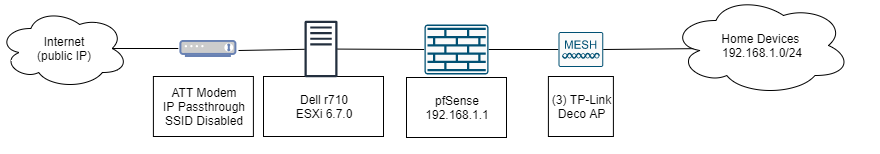
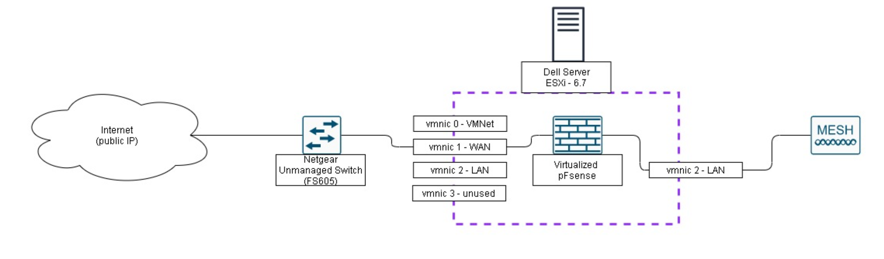

# Physical Hardware


## Physical Server 

The budget friendly solution we both purchased was a dell R710.

 


 Some good sources to get one cheap

```bash
https://www.ebay.com/sch/i.html?_from=R40&_trksid=p2380057.m570.l1312.R2.TR0.TRC0.A0.H1.X.TRS2&_nkw=dell+r710&_sacat=0
https://gsaauctions.gov/
https://www.facebook.com/marketplace/
```

## Network Equipment


Currently all networking equipment is consumer grade WiFi access points or mesh WiFi systems 


Currently looking into getting a couple L3 managed cisco switches and a decent cisco router. That way we can create the IPSEC tunnel via the hardware and also network more items in different enclaves. If we configure a network switch with a trunk and use explicit fail order on the distributed port group for the trunk you can access all the Vlans and use the pfsense as the router until you can afford a 2nd router. 


###  Installing pfSense and replacing your AT&T commercial router

I take no credit for this bypass. I used the help of others to implement this bypass and I just want to document the information/share the knowledge \(reference of bypass linked below\). This guide is oriented to those who AT&T fiber and do not have any other services being provided by AT&T \(such as AT&T U-Verse TV\). I wanted to replace my AT&T BGW210 with pfSense to be able to play around with the traffic at home and use it for other labs. This guide will present two options:   
1. Place the AT&T BGW210 in "bridged mode"   
2. Replace the AT&T BGW210 with pfSense



One thing to keep in mind, this guide takes advantage of the BGW210 only having to authenticate with AT&T at the very beginning. If the power at home were to ever shut down, I would have to plug the BGW210 back in and authenticate with AT&T before plugging my WAN back into pfSense.

#### Resources/Equipment Used

pfSense 2.4.4   
Dell R710 Server   
ESXi 6.7.0   
Unmannaged Switch   
Cat5e cables \(3\)   
TP-Link Deco

I have seen several guides for pfSense use ubiquiti access point's instead but the TP Link Deco I found was cheaper and provided similar capabilities.

### Option 1: "Bridged" Mode

I would only use this method if you didn't want to go through the hassel of plugging the BGW210 each time a power failure occured. Personally, I noticed slower connection speeds throughout the house by using this method.

Network Diagram Overview:



#### 1.A Enable IP Passthrough on modem

Unfortunately the modem does not have a bridged mode feature, but you can enable IP Passthrough on the admin page.   
  
1. Open a browser on a computer that is directly connected to the BGW210.  
2. In the address bar, enter [http://192.168.1.254](http://192.168.1.254).   
3. Select the Firewall tab in the RG GUI page.   
4. Select IP Passthrough below the Firewall tab.   
5. Select Passthrough option from the Allocation Mode drop-down menu.   
6. Select manual from the Passthrough Mode drop-down.   
7. Manually configure your device to use the WAN IP address, default gateway, and Subnet mask provided to you in Broadband &gt; Status.

#### 1.B Install pfSense with ESXi

I installed pfSense on ESXi using the [virtualizing pfSense Guide](https://docs.netgate.com/pfsense/en/latest/virtualization/virtualizing-pfsense-with-vmware-vsphere-esxi.html). I'll provide instructions as to where I deviated from the guide linked above.

Once the VM has been created, the WAN and LAN NICs have been assigned to the VM, and you completed the install, head on over to 192.168.1.1 \(or the IP you assigned on the LAN\) and run through the webConfig Wizard.

I begin to deviate from the guide by simply taking the information from Step 7 and adding it into the WAN interface. Example Below:


#### 1.C Adding TP-Link Deco.

Follow the basic set up guide that is provided in the box. Once set up, set the router in access point mode by going to More &gt; Advanced &gt; Operating Mode &gt; Access Point. By doing this you disable some of the security features that come with the device, but the goal was to be able to see every host that joins the network. You could leave it in router mode and have the mesh system double NAT within the network. It isn't best practice but I doubt your home network has enough devices that could impact the speed performance at home.

### Option 2: Replace AT&T Router

I caution this option as you will have to plug back in your AT&T BGW210 each time there is a power outage or if you need to reauthenticate your existing connection. Eventually AT&T will probably catch on to this bypass.

Network Diagram Overview:



I virtualized pfSense on a Dell Server with ESXi as the hypervisor. Prior to pfSense installation you'll have some Networking Setup. Add 1 virtual switch and port group per network you want to have/manage. At the very least add one for LAN and WAN.

#### 2.A Networking Prep

To add a virtual switch select Networking and then click on the Virtual Switches Tab. Select add standard virtual switch; add one per network i.e. 1 LAN & 1 WAN. Make sure to add an uplink to each virtual switch \(connects virtual switch to physical NIC on the back\). Then go to Port Group tab under Networking and add a port group for each virtual switch that was created. Note which physical NIC is assigned to WAN and LAN for later.

Now during pfSense VM setup make sure to add a Network Adapter for each virtual switch that was created. Under the WAN network adapter change the MAC address to the AT&T BGW210 MAC. It can be found on the side of the modem or on the AT&T admin page head on over to Broadband &gt; Status. Now when your pfSense boots up both the ether and HWaddr will have the MAC that was provided.

#### Final Steps

Once pfSense is installed, the WAN connection can be added to the respective physical NIC on the back of the server and the LAN NIC can be connected to the access point. To do this make sure you have connected your WAN connection to the Netgear switch and then to your ATT BGW210 WAN port. Once the device authenticates disconnect from the AT&T BGW210 and plug into the physical NIC assigned as the WAN on the server. pfSense should pull a public IP at this point. If there isn't any networking issues then plug your access point into the physical NIC assigned as the LAN and your network should be good to go. Feel free to start playing with pfSense and some of the additional services that can be installed such as pfBlocker or Suricata.


