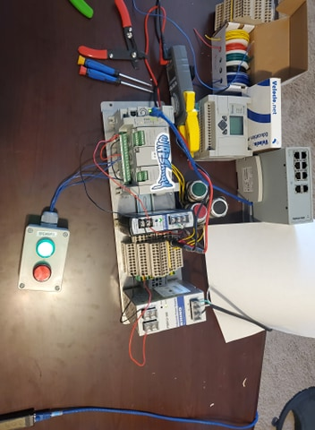
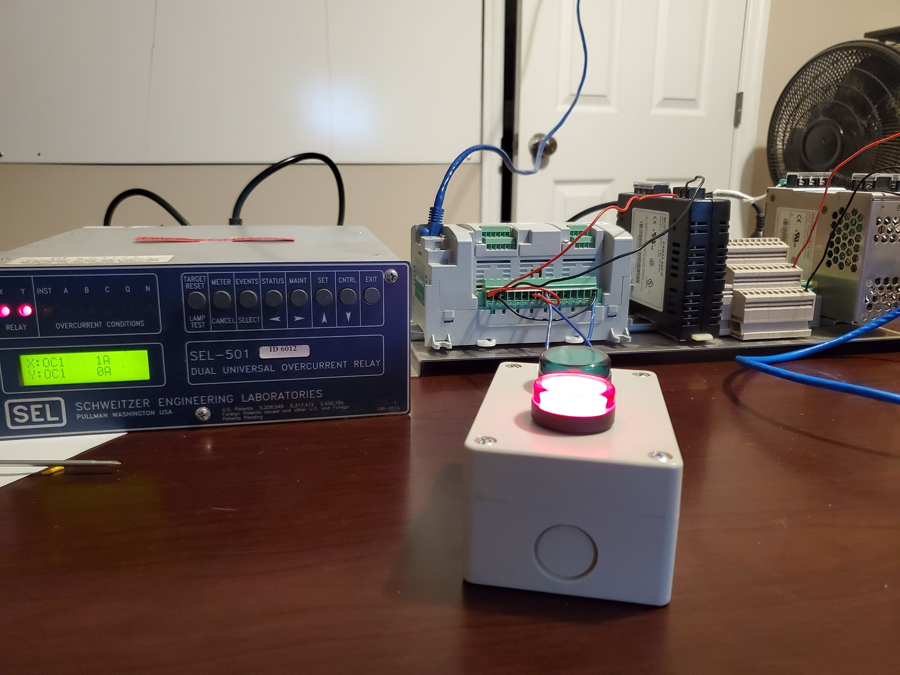
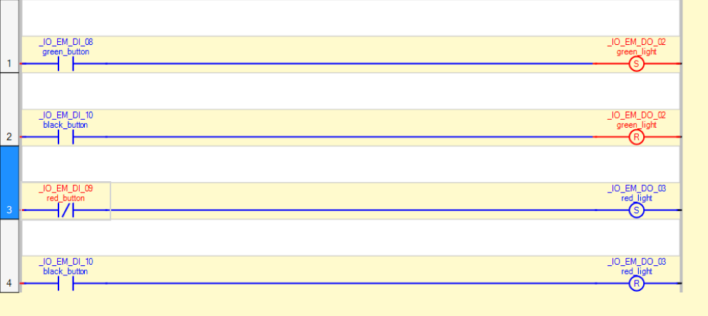

# Industrial Control Systems \(ICS\)

## Physically

### Industrial Processes Simulation

The main PLC is the Micro850 \(the one with the sticker\), however, we plan to interoperate the  Micrologix1100 as a producer of a tag or two in a process we have yet to think of... 

No wiring diagram created but the Black and Green buttons are NO and the Red button is NC. 

### Grid Simulation

For this project we mainly only want to simulate a over current condition on the "grid" and then make sure the data many cycles before and after the trip are recorded streamed to splunk.  

To generate the currents necessary to simulate fault conditions on an overcurrent relay like the SEL-501 we used a step-down transformer with a ratio of 120 Volts : 12 Volts to take wall-socket AC voltage and decrease it to a safer level while at the same time boosting current \(since a 10:1 voltage step-down ratio also yields a 10:1 step-_up_ current ratio\). We made sure to choose a transformer with its low-voltage \("secondary"\) winding rated for the amount of current I intended to pass through the SEL relay's inputs.  
REF: [https://www.youtube.com/watch?v=Sf7fwSlcDAg&t=200s](https://www.youtube.com/watch?v=Sf7fwSlcDAg&t=200s)

## Process Logic

The process logic on this PLC has changed many many times, but at the time of this photo a simple four rung ladder program was created to latch the light upon push of the respective color button and unlatch by pushing the black. 

As you can see we make use of Rockwell latching/unlatching \(or set/reset in CCW\) blocks. Since the red button is NC we need to XIO and the other two buttons are NO to we XIC.

## Splunking with ICS data...  

See the [SCADA Splunk](../scada-splunk.md) page 

